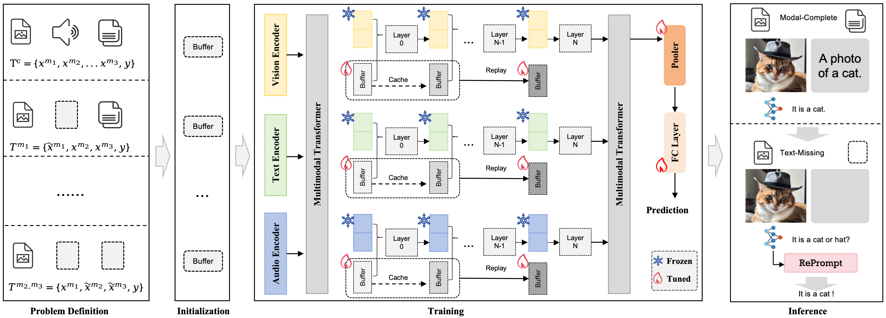
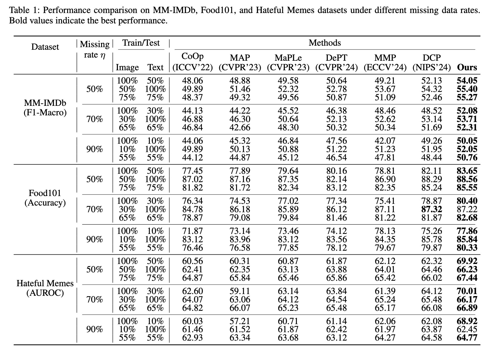
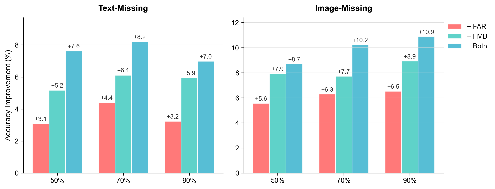

# REP: Replay-Enhance Prompting for RobustMultimodal Learning with Missing Modalities

Official PyTorch implementaton of the paper "REP: Replay-Enhance Prompting for RobustMultimodal Learning with Missing Modalities".

## Introduction
Multimodal models suffer significant performance degradation under missing-modality scenarios. To improve robustness, existing researches employ prompt-learning-based methods to fine-tune multimodal models that enables models to perform effectively when handling data with missing modalities. These prompt-learning methods rely on features from adjacent layers for parameter updates. However, we observed that modality-specific fine-grained information present in the early layers tends to gradually loss as network depth increases. This loss of information has a more detrimental effect on tasks involving missing modal data compared to ordinary tasks. To mitigate this issue, we propose a Feature Aggregation and Replay (FAR) mechanism that maintains a feature buffer to store intermediate representations from early layers and replays them into deeper layers to supply complementary information. Furthermore, to better exploit the characteristics of the data, in addition to learning shared features across modalities, we place emphasis on extracting private features that are exclusive to each modality. Specifically, we design a private–hared feature separation strategy, where private buffers preserve fine-grained, modality-specific information, while shared buffers capture cross-modal semantic representations. By leveraging the distinct compensatory capabilities of shared and private features under various missing-modality scenarios, the model achieves better performance across diverse multimodal tasks.

<div align="center">
  
</div>

## Performance
We conducted experiments on multiple multimodal benchmark datasets, including vision-language and vision-language-audio tasks. For vision-language tasks, we employed a pre-trained CLIP model.

### VL tasks
<div align="center">
  
</div>

For VLA tasks, pre-train the model on CMU-MOSEI without prompts, and then evaluated on CMU-MOSI and CH-SIMS. Please refer to [MPLMM](https://github.com/zrguo/MPLMM)

### Ablation study
In this setting, all methods are trained on the dataset with data missing.
<div align="center">
  
</div>
More results and analysis can be find in the paper.

## Usage
### Enviroment
For VL task:
```
Cuda=11.3, Pytorch=1.8.0, Python=3.8

pip install -r requirements.txt
```
For VLA tasks, Please refer to [MPLMM]([https://github.com/hulianyuyy/Deep_Correlated_Prompting](https://github.com/zrguo/MPLMM)). For AS task, please refer to [FOCAL]([https://github.com/tomoyoshki/focal/tree/main])
### Prepare Dataset
We use three vision and language datasets: [MM-IMDb](https://github.com/johnarevalo/gmu-mmimdb), [UPMC Food-101](https://visiir.isir.upmc.fr/explore), and [Hateful Memes](https://ai.facebook.com/blog/hateful-memes-challenge-and-data-set/). Please download the datasets by yourself. We use `pyarrow` to serialize the datasets, the conversion codes are located in `vilt/utils/wirte_*.py`. Please see [`DATA.md`](./DATA.md) to organize the datasets, otherwise you may need to revise the `write_*.py` files to meet your dataset path and files. Run the following script to create the pyarrow binary file:
```
python make_arrow.py --dataset [DATASET] --root [YOUR_DATASET_ROOT]
```

### Implementation
The key implementations for our proposed method are located in the [clip_dynamic_memory.py](./clip/modules/clip_dynamic_memory.py) and [vision_transformer_memory.py](./clip/modules/vision_transformer_memory.py), which defines the DHM and base modules, respectively.

### Train
```
python run.py with data_root=<ARROW_ROOT> \
        num_gpus=<NUM_GPUS> \
        num_nodes=<NUM_NODES> \
        per_gpu_batchsize=<BS_FITS_YOUR_GPU> \
        <task_finetune_mmimdb or task_finetune_food101 or task_finetune_hatememes> \
        exp_name=<EXP_NAME>
```
Example command:
```
python run.py with data_root=/path_to_mmimdb num_gpus=1 num_nodes=1 per_gpu_batchsize=32 task_finetune_mmimdb exp_name=exp_base
```
### Evaluation
```
python run.py with data_root=<ARROW_ROOT> \
        num_gpus=<NUM_GPUS> \
        num_nodes=<NUM_NODES> \
        per_gpu_batchsize=<BS_FITS_YOUR_GPU> \
        <task_finetune_mmimdb or task_finetune_food101 or task_finetune_hatememes> \
        load_path=<MODEL_PATH> \
        exp_name=<EXP_NAME> \
        prompt_type=<PROMPT_TYPE> \
        test_ratio=<TEST_RATIO> \
        test_type=<TEST_TYPE> \
        test_only=True     
```
Example command:
```
python run.py with data_root=/path_to_mmimd num_gpus=1 num_nodes=1 per_gpu_batchsize=32 task_finetune_mmimdb load_path=/path_to_your_pretrained.ckpt test_only=True test_ratio=0.7 test_type=both exp_name=exp_test
```
### Checkpoints

```
If you wish to replicate the experimental results, you can refer to our open weights. Currently, we only have a Baidu Cloud link, which we will update in the future.

The file naming convention is: chpts/[datasets]/[missing rate]/[missing type]/[results_epoch=xxx-step=xxx.step]

Checkpoints are available at: https://pan.baidu.com/s/1rvKjtliMZEQPgEMI5GYD0w?pwd=vjen password: vjen 


```


## Acknowledgements
This code is based on  [DCP](https://github.com/hulianyuyy/Deep_Correlated_Prompting) and [MAP](https://github.com/yilunlee/missing_aware_prompts). Many thanks for their contributions. 
